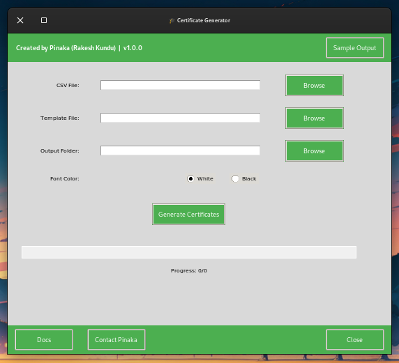
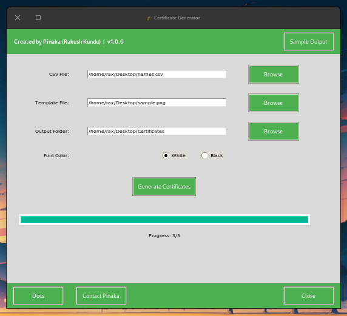
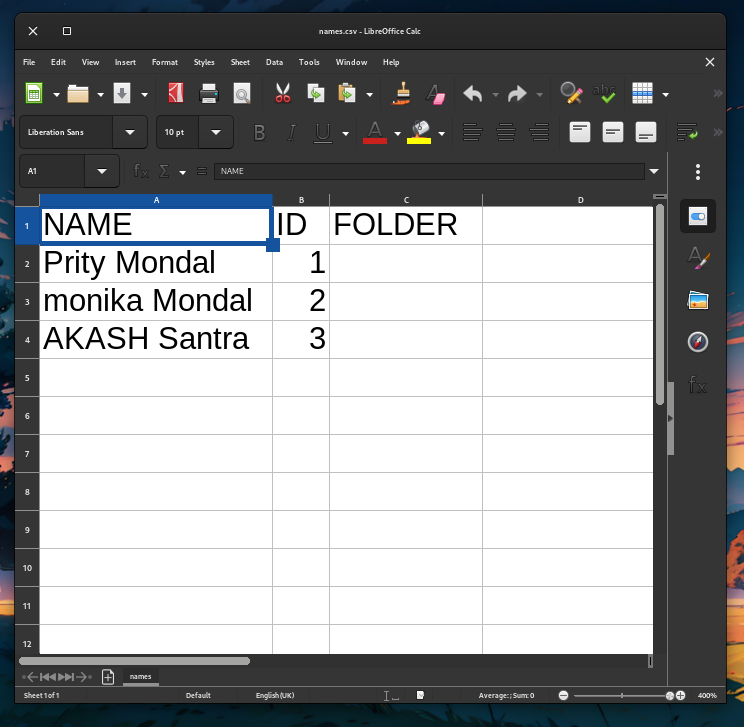

# 🧾 Certificate Generator – Python GUI Tool

A modern, GUI-based Python certificate generator that takes user data from a CSV file and produces customized certificates using a given template image. Designed for event organizers, academic institutions, clubs, and professional bodies who need to generate certificates in bulk — quickly and beautifully.

---

## 🌟 Features

- ✅ User-friendly GUI interface
- 🖼️ Template-based certificate generation
- 📥 CSV-based bulk input support
- ✍️ Signature-style font support
- 🎨 Font color selection (Black / White)
- 🧪 Live sample output generation
- 📊 Progress bar for generation status
- ⚡ One-click silent launch via desktop shortcut (Windows only)

---

## 📁 File Structure

```
Certificate-Generator/
│
├── main.py              # Main GUI logic
├── run.vbs              # Silent launcher for Windows
├── run.bat              # Alternate batch launcher
├── icon.ico             # Application icon
├── package.txt          # Python dependency list
│
├── fonts/
│   └── Photograph Signature.ttf
│
├── template/
│   └── sampleoutput.png
│
└── docs/
    └── img/
        ├── before_run.png
        ├── after_run.png
        ├── csv_example.png
        └── sample_certificate.png
```

---

## 🖼️ Screenshot Previews

| Before Launch | After Certificate Generation |
|---------------|------------------------------|
|  |  |

| Sample CSV | Sample Output |
|------------|---------------|
|  |  |

> 📸 *Screenshots should be placed inside `docs/img/` with the specified names to show previews in your documentation.*

---

## 📦 Installation (Windows)

### 1. Install Python
- Download Python 3.8+ from [python.org](https://www.python.org/downloads/)
- ✅ Make sure to check **“Add Python to PATH”** during installation

### 2. Install Dependencies
Navigate to the project folder and run:
```bash
pip install -r package.txt
```

### 3. Prepare Font & Template
- Make sure `Photograph Signature.ttf` is in the `fonts/` folder
- The certificate **template image must be a `.png` file** of size **1123 x 794 pixels** (A4 @ 96 DPI)
- Replace `template/sampleoutput.png` with your custom design or edit the existing one

### 4. Optional (Silent Launch Setup)
- Right-click on `run.vbs` → `Send to` → `Desktop (create shortcut)`
- Now you can launch the tool without seeing a terminal window

---

## ▶️ Running the Application

### 💼 Preferred Way (Silent)
Double-click the **desktop shortcut** to `run.vbs` for clean launch experience.

### 🐍 Alternate Way (Command Line)
```bash
python main.py
```

---

## 📄 CSV Format & Instructions

Your input CSV file should contain **exactly** the following **case-sensitive** column names:

| NAME          | ID     | FOLDER    |
|---------------|--------|-----------|
| Rakesh Kundu  | 1001   | ECE       |
| Alice Johnson |        | HR        |
| John Doe      | 1055   |           |

- `NAME` – required, case-sensitive  
- `ID` – optional  
- `FOLDER` – optional  
- If `FOLDER` is specified, generated certificates will be saved inside that subfolder

> ⚠️ **Column headers must be in uppercase as shown: `NAME`, `ID`, `FOLDER`**

---

## 🧪 Sample Output Button

Use the **“Sample Output”** button before generating certificates to preview the layout and font styling.

- Sample Name: `Rakesh Kundu`
- ID: `Sample`
- Folder: `SampleOutput`

---

## 🖼️ Template Requirements

- Supported format: `.png`
- Required resolution: **1123 x 794 pixels**
- Edit the default template export in `Sample output` using any image editor (e.g., Photoshop, Canva, Figma, GIMP)

For best results:
- Use high-quality fonts
- Place placeholders in areas with enough space
- Avoid crowding near the name area

---

## 💾 Output Files

- Saved in PNG format: `Name_ID_Certificate.png` or `Name_Certificate.png`
- Saved to the current working directory or folder specified in `FOLDER` column
- Clean file naming avoids overwriting existing files

---

## 💡 Tips & Best Practices

- Use high-resolution certificate designs for clarity
- Test with a few entries before generating in bulk
- Avoid using special characters in folder names
- Keep backup of your template before editing
- Confirm CSV column headers are correctly typed

---

## 👨‍💻 Developed By

**Rakesh Kundu**  
📂 [GitHub - rax-2](https://github.com/rax-2)  
🌐 [Portfolio Website](https://trishul-a.github.io/portfolio)

---

## 📜 License

This project is open-source and free to use under the MIT License. Contributions are welcome!

---
